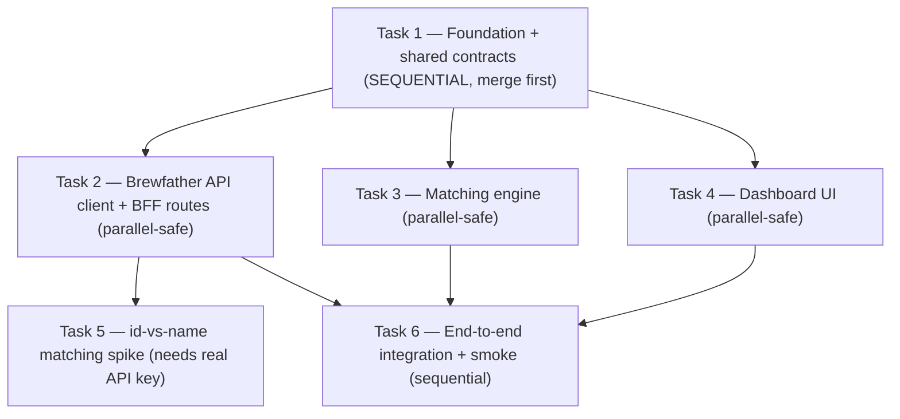

# Brewable v0 — "Prove the magic" (inventory-aware recipe matching)

Implement the plan task by task. Each task must be developed, reviewed with the
`/code-review` skill until clean, opened as its own pull request, merged, and
verified before dependent work starts — except the tasks explicitly marked
**parallel-safe**, which may run concurrently on separate branch worktrees.

**Goal (v0 scope, per [issue #1](https://github.com/Micaxes/brewfather/issues/1)):**
A local, single-user web app that connects to the owner's Brewfather account via
a read-only API key in `.env`, pulls live **inventory** + **saved recipes**, runs
a deterministic **matching engine**, and renders a ranked "what can I brew now?"
dashboard (✅ Brew now / 🟡 Almost + shopping list / ⚪ Not yet). No database, no
auth, no AI — those are out of scope for v0.

**Explicit exclusions (v0):** Supabase/auth/Vault, hosted deployment, AI
substitutions, pushing batches back to Brewfather. Substitution logic is
**rules-based deterministic only**.

## Core Rules

- Stack is fixed by the PRD: **Next.js (App Router) + TypeScript**, **Tailwind +
  shadcn/ui**, server-side **BFF** route handlers (the Brewfather key never
  reaches the client), **Fuse.js** for fuzzy name matching, **Vitest** for tests.
- Work the foundation task (Task 1) to merge **first**. Do not start any
  parallel-safe task until Task 1 is merged into `main`.
- Parallel-safe tasks (2, 3, 4) have **disjoint file ownership** (declared per
  task) and integrate only through the shared type contracts created in Task 1.
  They may run concurrently on separate branches.
- Dependent tasks (5, 6) must not start until their prerequisites are merged.
- **Reviews use the `/code-review` skill** (not `codex exec review`). Run it on
  the task's diff, iterate via the Review-Fix Loop until it reports no blocking
  findings, then open the PR. Skip gitmoot's native review fan-out
  (`--skip-native-review-fanout`) so review is not duplicated.
- Gitmoot owns repository orchestration: branch creation, worktrees, branch
  locks, commits, pushes, PRs, the merge gate, and conflict resolution. Do not
  hand-roll those inside `agent ask`.
- Verify external contracts before coding against them — confirm the real
  Brewfather API response shapes from `docs/CONCEPT.md` / [docs.brewfather.app/api](https://docs.brewfather.app/api)
  and, where a live call is needed, from the real API (Task 5).
- Do not commit secrets, `.env`, `node_modules`, build output, caches, or large
  fixtures beyond small representative JSON.
- Keep changes scoped to the task. Avoid broad rewrites and duplicated logic;
  extract small shared helpers that match repo patterns.

## Before Starting (each task)

1. Inspect repo state: `git status --short`, current branch, current remote.
2. Confirm the base branch is the latest `main`. If the worktree has unrelated
   changes that make the task commit ambiguous, stop and ask.
3. Confirm PR tooling: `gh auth status`; remote resolves to `Micaxes/brewfather`.
4. Read the shared contracts in `lib/` before editing so types stay consistent.

## Per-Task Branch Workflow

1. Branch from the latest `main` (gitmoot's task worktree).
2. Implement only that task, within its declared file ownership.
3. Add/Update focused Vitest tests for the touched modules.
4. Run `npm run typecheck`, `npm run lint`, and `npm test` for touched modules;
   run the full suite when the task touches shared contracts or the API surface.
5. Run an operational smoke check appropriate to the task (e.g. `npm run build`
   for app-shell changes; a real/fixture data run for the API client).

## Review-Fix Loop (per task)

1. Run the **`/code-review`** skill on the uncommitted diff.
2. For each finding, identify the underlying class of bug, audit sibling paths
   for the same issue, and plan the smallest safe fix.
3. Execute the fix; re-run focused tests/checks and `/code-review`.
4. Repeat until `/code-review` reports no blocking findings, or stop and report
   if blocked or if a finding is incorrect after verification.

## Commit Gate

1. `git diff --check`; inspect the final diff; commit only this task's changes.
2. Use the task's suggested commit message (conventional, task-scoped).
3. Push the task branch; verify the worktree is clean after push.

## Pull Request Gate

1. One PR per task; the title describes only that task.
2. PR body includes **WHAT / WHY / CHANGES / RESULTS / RISK** and the summary of
   the final `/code-review` pass.
3. Wait for any CI checks; fix failures before merge.
4. Merge with **squash** for clean task-level history.
5. After merge, update local `main`, verify the worktree is clean, and record the
   PR number, URL, branch, and merged commit hash.

## Parallel Task Rules

- Parallelize only Tasks 2, 3, 4 (independent, disjoint ownership), each on its
  own branch, after Task 1 is merged.
- The merge gate updates stale branches and retries automatically. If a real
  content conflict remains, resolve it in an explicit follow-up fix task and
  re-run checks + `/code-review`; do not force-merge over a conflict.
- If a "parallel" task turns out to depend on another, stop treating it as
  parallel and merge the dependency first.

## Task Dependency Graph

## Final Response After All Tasks

- List completed tasks; for each: branch, PR URL, merge status, merged commit.
- List tests/checks run and the final `/code-review` outcome per task.
- Note any skipped checks, blockers (e.g. Task 5 awaiting the API key), or risk.

---

## Implementation Tasks

### Task 1: Foundation scaffold + shared type contracts

**SEQUENTIAL — must merge before Tasks 2–4.**

Scaffold the project skeleton and define the type contracts every other task
builds against. This is the keystone that makes the rest parallelizable.

- Initialize **Next.js (App Router) + TypeScript** with **Tailwind** and
  initialize **shadcn/ui**. Add ESLint + Prettier and a strict `tsconfig`.
- Configure **Vitest** (+ React Testing Library) with one trivial passing test.
- Add **all** npm scripts now so parallel tasks never edit `package.json`:
  `dev`, `build`, `start`, `lint`, `typecheck`, `test`, `test:watch`, and
  `spike` (`tsx scripts/match-spike.ts`). Add `fuse.js` and `tsx` as deps.
- Create `.env.example` with `BF_USER_ID=` and `BF_API_KEY=` and document them.
  Confirm `.env` is gitignored.
- Create the **shared contracts** (types only, no logic) — these are frozen
  interfaces the parallel tasks import:
  - `lib/brewfather/types.ts` — `InventoryItem` (id, name, category, amount,
    unit, plus alpha/color/attenuation where relevant), `Recipe`,
    `RecipeIngredient` (id, name, category, amount, unit), `RecipeDetail`.
  - `lib/matcher/types.ts` — `IngredientMatch` (status: `satisfied|short|missing`,
    have, need, shortfall), `RecipeMatch` (bucket: `brew_now|almost|not_yet`,
    score, ingredientMatches, shoppingList), `MatchInput`/`MatchResult`.
  - `lib/api-contract.ts` — the `/api/brew-candidates` response type
    (`{ candidates: RecipeMatch[]; generatedAt: string; warnings: string[] }`).
- App shell: `app/layout.tsx`, `app/globals.css`, and a placeholder
  `app/page.tsx` linking to the (empty) dashboard route.
- **Owns:** `package.json`, `tsconfig.json`, `next.config.*`, `tailwind.config.*`,
  `postcss.config.*`, `.eslintrc*`, `.prettierrc*`, `vitest.config.*`,
  `app/layout.tsx`, `app/globals.css`, `app/page.tsx`, `lib/brewfather/types.ts`,
  `lib/matcher/types.ts`, `lib/api-contract.ts`, `components/ui/**` (shadcn),
  `.env.example`, test setup.
- **Acceptance:** `npm run build`, `npm run typecheck`, `npm run lint`, `npm test`
  all pass; the contracts compile and are importable.
- **Commit:** `chore: scaffold Next.js app and shared type contracts`

### Task 2: Brewfather API client + BFF route handlers

**PARALLEL-SAFE (after Task 1).**

- `lib/brewfather/client.ts` — typed client using **Basic Auth**
  (`base64(BF_USER_ID:BF_API_KEY)` from env, server-only). Methods to fetch
  inventory (`/v2/inventory/{fermentables,hops,yeasts,miscs}`) and recipes
  (`/v2/recipes` list + `/v2/recipes/:id` detail). Handle pagination
  (`limit`/`start_after`, max 50), and **honor `429` + `Retry-After`** with
  bounded backoff. Normalize responses to the Task 1 `types.ts` shapes.
- `app/api/brew-candidates/route.ts` — BFF handler: load inventory + recipe
  details server-side, call the matcher (imported from `lib/matcher`, behind its
  typed interface), return the `lib/api-contract.ts` shape. Never expose the key
  or raw upstream payloads to the client; validate/sanitize inputs.
- **Owns:** `lib/brewfather/client.ts`, `lib/brewfather/*.ts` (NOT `types.ts`),
  `app/api/**`.
- **Tests:** Vitest unit tests with mocked `fetch` — auth header construction,
  pagination, 429/Retry-After backoff, response normalization.
- **Acceptance:** tests pass; handler typechecks against the contract; a
  documented manual `curl`/script check of the auth header shape.
- **Commit:** `feat: add Brewfather API client and brew-candidates BFF route`

### Task 3: Matching engine (deterministic, pure logic)

**PARALLEL-SAFE (after Task 1).**

- `lib/matcher/match.ts` — pure functions over the Task 1 types. For each recipe:
  match each `RecipeIngredient` to an `InventoryItem` by **stable `_id` first**,
  then **normalized-name fuzzy fallback** (Fuse.js, tuned threshold); compute
  `have >= need` per ingredient; produce `IngredientMatch[]`.
- `lib/matcher/score.ts` — weighted brewability score (yeast + base malt
  critical, bittering hops high, specialty/aroma medium, small miscs low) and
  bucket into `brew_now | almost | not_yet`; build the shopping-list shortfalls
  for `almost`.
- `lib/matcher/normalize.ts` — name normalization + unit handling (metric).
- **Owns:** `lib/matcher/*.ts` (NOT `types.ts`), `lib/matcher/__tests__/**`,
  `lib/matcher/fixtures/*.json` (small representative inventory + recipe JSON).
- **Tests:** table-driven Vitest cases — exact-id match, fuzzy-name match,
  insufficient quantity, fully missing ingredient, bucket boundaries, shopping
  list correctness.
- **Acceptance:** tests pass; functions are pure (no I/O); typecheck clean.
- **Commit:** `feat: add deterministic inventory-to-recipe matching engine`

### Task 4: Dashboard UI ("what can I brew now?")

**PARALLEL-SAFE (after Task 1).**

- `app/(dashboard)/page.tsx` — fetches `/api/brew-candidates` and renders three
  sections: **✅ Brew now**, **🟡 Almost** (with per-recipe shopping list), **⚪
  Not yet**. Recipe cards show the brewability score and matched/short/missing
  ingredients. Loading, empty, and error states. An onboarding hint when no
  candidates (set the env key / save recipes in Brewfather).
- `components/brew/**` — `RecipeCard`, `IngredientList`, `ShoppingList`,
  `BucketSection`, built on shadcn/ui primitives. Codes against the
  `lib/api-contract.ts` type; may use a small mock during isolated development.
- **Owns:** `app/(dashboard)/**`, `components/brew/**`.
- **Tests:** component tests (React Testing Library) for the three buckets,
  shopping-list rendering, and the empty state.
- **Acceptance:** `npm run build` passes; renders against mock contract data.
- **Commit:** `feat: add brew-candidates dashboard UI`

### Task 5: `_id`-vs-name matching spike (validate the core assumption)

**Depends on Task 2. NEEDS the real Brewfather API key** — if the key is not
present in `.env`, return `blocked`/`needs` rather than guessing.

- `scripts/match-spike.ts` — using the Task 2 client, pull the owner's real
  inventory + a sample of saved recipes and measure how often a recipe
  ingredient resolves to an inventory item by **`_id`** vs requiring **name**
  matching. Print a summary and write `docs/spikes/id-vs-name.md` with the
  numbers and a recommended Fuse.js threshold.
- **Owns:** `scripts/match-spike.ts`, `docs/spikes/**`.
- **Acceptance:** the spike runs against real data and produces the report (or
  cleanly reports `blocked` if the key is absent).
- **Commit:** `chore: add id-vs-name matching spike and findings`

### Task 6: End-to-end integration + smoke

**Depends on Tasks 2, 3, 4 (sequential).**

- Wire the dashboard → BFF → matcher end-to-end (replace any UI mock with the
  real `/api/brew-candidates` call). Tune the Fuse.js threshold per Task 5's
  findings if available.
- `e2e/**` — a smoke test (Playwright or a route-level integration test) that
  boots the app and asserts the three buckets render for fixture data.
- Update `README.md` with local run instructions (`.env` setup, `npm run dev`).
- **Owns:** `e2e/**`, the integration glue in `app/(dashboard)/page.tsx`
  (after Task 4 merged), `README.md`.
- **Acceptance:** end-to-end smoke passes against fixtures; `npm run dev` shows a
  correct ranked list from real Brewfather data when the key is set.
- **Commit:** `feat: wire dashboard end-to-end and add smoke test`
